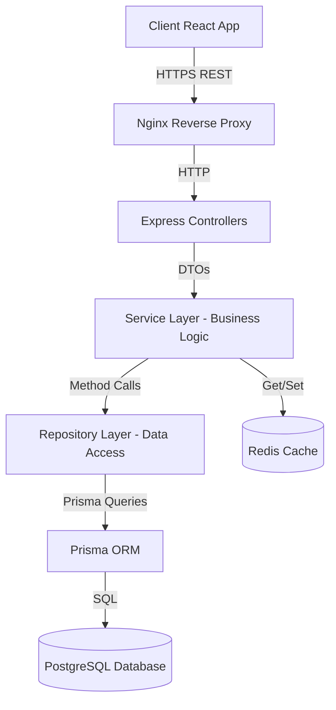
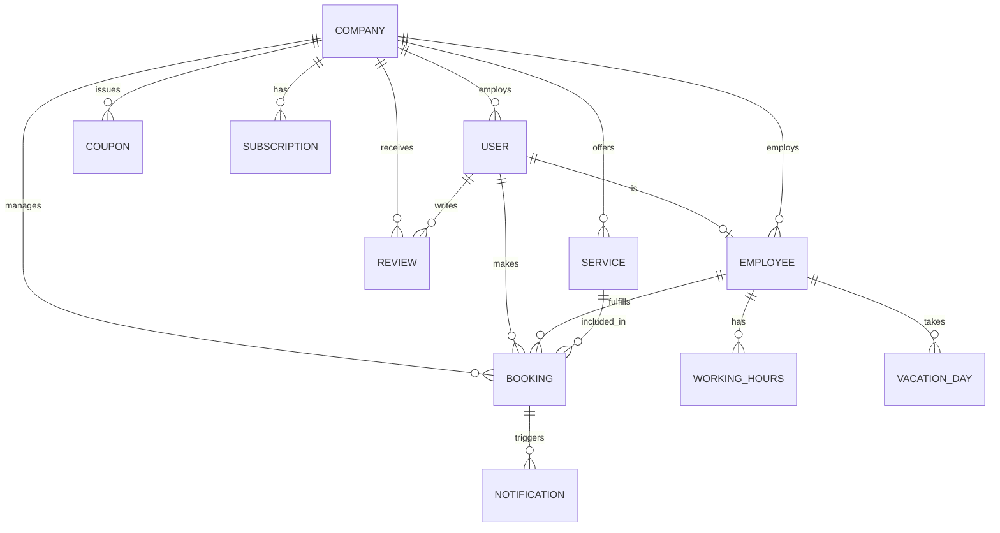
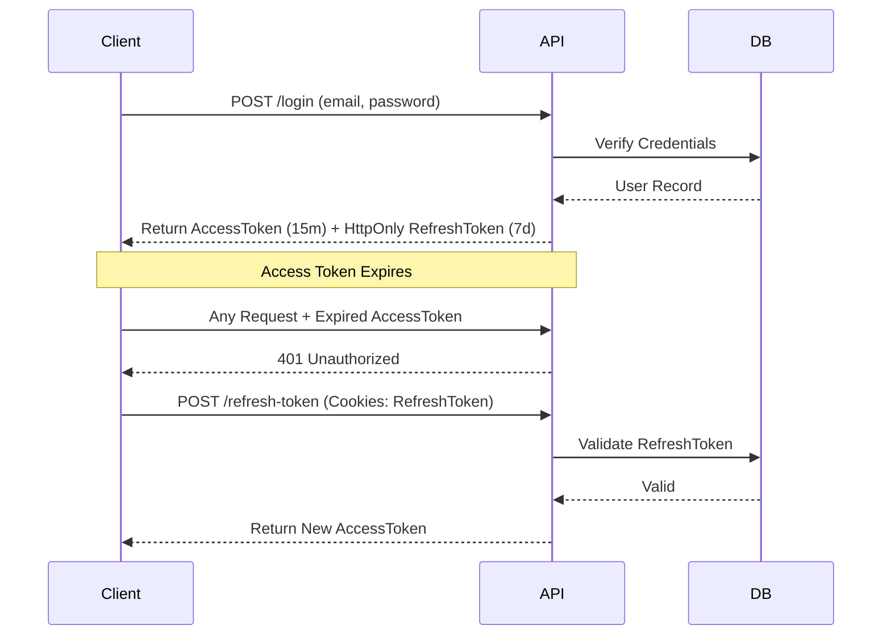
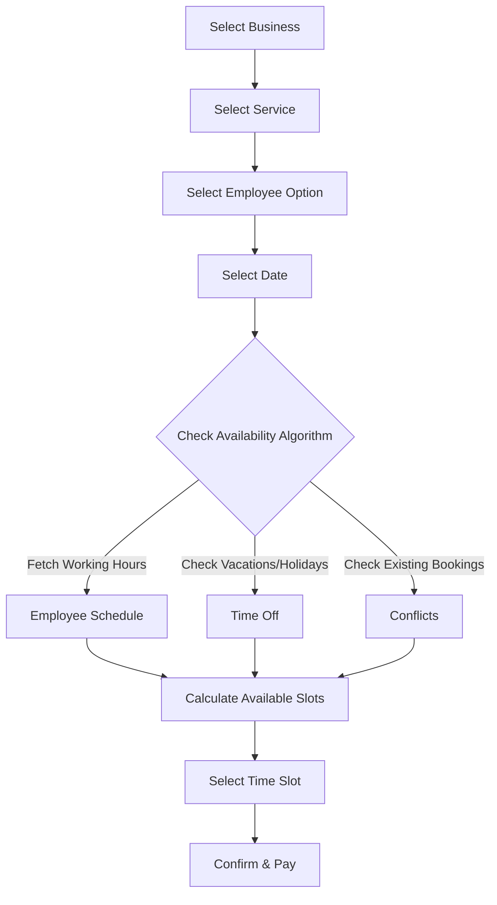
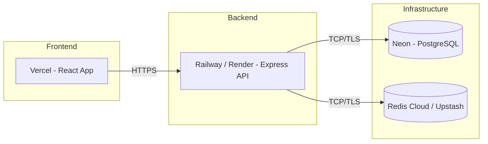

# BookingHub Architecture Document

## System Overview
BookingHub is a multi-tenant SaaS booking platform designed to provide a robust, isolated, and scalable scheduling solution for various service-oriented businesses (tenants). The system ensures that each company gets isolated data within a shared database infrastructure.

**Request Flow:**
`Client` → `Nginx (Reverse Proxy)` → `Express API` → `Service Layer` → `Repository Layer` → `PostgreSQL / Redis`

1. **Client**: A React application (web/mobile) sending RESTful requests.
2. **Nginx**: Acts as a reverse proxy, handling SSL termination, rate limiting, and routing requests to the appropriate backend services.
3. **Express API**: The entry point for the backend, responsible for routing, middleware execution (auth, validation, tenant context), and controller delegation.
4. **Service Layer**: Contains the core business logic, orchestrating calls between repositories and external services (e.g., Stripe, Nodemailer).
5. **Repository Layer**: Abstracts data access logic, providing a clean interface for the service layer to interact with the database.
6. **PostgreSQL / Redis**: PostgreSQL serves as the primary relational database, while Redis is used for caching, session management, and rate limiting.

## Multi-Tenancy Strategy
BookingHub employs a **Shared Database, Shared Schema** multi-tenancy model. 
- **Tenant Isolation**: Achieved via a `companyId` foreign key present on almost every table (except global tables like `User` and `Company` itself).
- **Query Scoping**: Every database query is strictly scoped by `companyId` to prevent cross-tenant data leakage.
- **Middleware Context**: A custom middleware extracts the tenant context (usually from the subdomain, custom header, or user token) and injects it into the request object (`req.tenant`), making it implicitly available to downstream layers.

## Architecture Layers

## Database Schema

## Authentication & Authorization Flow
BookingHub utilizes a combination of JWT-based authentication and Role-Based Access Control (RBAC).

### JWT Access + Refresh Token Flow

### RBAC Permission Matrix
| Role | Manage Users | Manage Services | Manage Employees | View Analytics | Manage Settings | Manage Bookings |
|---|---|---|---|---|---|---|
| **Super Admin** | ✅ All | ✅ All | ✅ All | ✅ All | ✅ All | ✅ All |
| **Company Admin**| ✅ Own | ✅ Own | ✅ Own | ✅ Own | ✅ Own | ✅ Own |
| **Employee** | ❌ | ❌ | ❌ | ❌ | ❌ | ✅ Own |
| **Customer** | ❌ | ❌ | ❌ | ❌ | ❌ | ✅ Own |

## Booking Engine Flow
The core scheduling logic ensures double bookings are impossible and respects complex availability rules.

## Subscription & Billing
BookingHub uses a tiered subscription model managed via Stripe.
- **Free Tier**: Limited bookings/month, 1 employee, basic features.
- **Basic Tier**: Moderate bookings, up to 5 employees, standard support.
- **Premium Tier**: Unlimited bookings, unlimited employees, advanced analytics, priority support.
- **Flow**: Webhook integration listens for `invoice.payment_succeeded`, `customer.subscription.updated`, and `customer.subscription.deleted` to update the company's status in the database.

## Caching Strategy
Redis is heavily utilized to optimize performance and reduce database load:
- **Session & Tokens**: Storing refresh tokens and blacklisted access tokens.
- **Rate Limiting**: IP and user-based request throttling.
- **Frequently Accessed Data**:
  - `GET /services/company/:id` (invalidated on service update)
  - `GET /employees/:id/availability` (cached for short intervals)
  - Public company profiles.

## Notification Pipeline
A centralized notification service handles asynchronous messaging.
- **Trigger**: Domain events (e.g., `BookingCreated`, `BookingCancelled`) are emitted.
- **Processing**: The notification service listens to these events and formats the appropriate templates.
- **Delivery**: Emails are dispatched via Nodemailer (using services like SendGrid or AWS SES).
- **Types**:
  - Booking Confirmations (to Customer & Employee)
  - Reminders (24h before)
  - Cancellations/Rescheduling
  - Admin Approvals (if manual approval is required)

## Deployment Architecture

