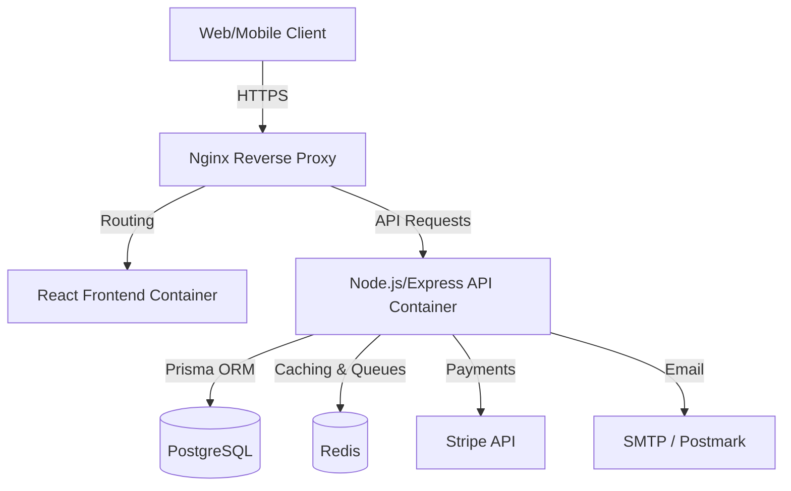

# BookingHub - Multi-Tenant SaaS Booking Platform

[](#)
[](https://opensource.org/licenses/MIT)
[](#)
[](#)
[](#)

> A modern, scalable, and professional multi-tenant SaaS booking platform designed for businesses of all sizes.

## 📖 Overview

BookingHub is a multi-tenant Software as a Service (SaaS) platform built to handle complex booking workflows. It enables businesses (tenants) to manage their services, employees, and appointments in isolation, while sharing the same underlying infrastructure. Designed with clean architecture principles, it features robust Role-Based Access Control (RBAC), real-time notifications, subscription management, and analytics.

## 🏗 Architecture



## 💻 Tech Stack

| Domain | Technologies |
|--------|-------------|
| **Backend** | Node.js, Express, PostgreSQL, Prisma ORM, Redis, JWT, Passport OAuth, Nodemailer, Multer, Swagger |
| **Frontend** | React, TypeScript, Tailwind CSS v4, React Query, React Hook Form |
| **DevOps** | Docker, Docker Compose, GitHub Actions, Nginx |

## 👥 Roles & Permissions

BookingHub implements a granular Role-Based Access Control (RBAC) system:

- **Super Admin**: Manages the entire platform, tenants, subscription plans, and global analytics.
- **Company Admin**: Manages their specific business tenant, settings, employees, services, and views business-specific analytics.
- **Employee**: Manages their personal schedule, appointments, and client interactions within the company they are assigned to.
- **Customer**: Browses services, books appointments, manages their own profile and booking history.

## ✨ Features

- **Authentication**: JWT-based auth, Refresh Tokens, OAuth (Google/Facebook), Password Reset, Email Verification.
- **Booking Engine**: Conflict-free scheduling, timezone handling, recurring appointments.
- **Tenant Management**: Full data isolation per company, customizable business hours, locations.
- **Service & Employee Management**: Assign specific services to specific employees, variable durations, pricing.
- **Dashboard & Analytics**: Revenue tracking, appointment metrics, employee performance.
- **Notifications**: Email alerts, SMS integrations, in-app real-time notifications via WebSockets/Redis.
- **Subscription Plans**: Free, Basic, and Premium tiers using Stripe integration.
- **Marketing & Retention**: Reviews & Ratings, Coupons/Promo Codes.
- **Reporting**: Export data via CSV, Excel, or PDF.

## 🛣 API Endpoints Overview

| Method | Endpoint | Description | Auth Required |
|--------|----------|-------------|---------------|
| POST | `/api/v1/auth/register` | Register a new user/company | No |
| POST | `/api/v1/auth/login` | Authenticate user | No |
| GET | `/api/v1/tenants` | List companies (public info) | No |
| POST | `/api/v1/bookings` | Create an appointment | Yes |
| GET | `/api/v1/services` | List available services | No |
| POST | `/api/v1/admin/plans` | Create a subscription plan | Super Admin |

*(Comprehensive API documentation available via Swagger at `/api/docs` when running locally)*

## 🚀 Getting Started

### Prerequisites
- [Node.js](https://nodejs.org/) (v20+)
- [Docker](https://www.docker.com/) & Docker Compose
- [PostgreSQL](https://www.postgresql.org/) (if running locally without Docker)
- [Redis](https://redis.io/)

### Setup

1. **Clone the repository**
   ```bash
   git clone https://github.com/yourusername/bookinghub.git
   cd bookinghub
   ```

2. **Environment Variables**
   ```bash
   cp .env.example .env
   # Edit .env with your specific credentials
   ```

3. **Start the infrastructure via Docker**
   ```bash
   docker-compose up -d
   ```

4. **Run Database Migrations**
   ```bash
   cd backend
   npm install
   npx prisma migrate dev
   npm run seed
   ```

5. **Start Frontend**
   ```bash
   cd ../frontend
   npm install
   npm run dev
   ```

## ⚙️ Environment Variables

See `.env.example` for a complete list of required environment variables. Key variables include:
- `DATABASE_URL`: Connection string for PostgreSQL
- `REDIS_URL`: Connection string for Redis
- `JWT_SECRET`: Secret for signing access tokens
- `STRIPE_SECRET_KEY`: For processing payments and subscriptions

## 📂 Project Structure

```
bookinghub/
├── backend/
│   ├── src/
│   │   ├── config/       # App configurations (DB, Redis, etc.)
│   │   ├── controllers/  # Request handlers
│   │   ├── middlewares/  # Custom Express middlewares
│   │   ├── models/       # Prisma schema & custom DB logic
│   │   ├── routes/       # API route definitions
│   │   ├── services/     # Business logic layer
│   │   └── utils/        # Helper functions
│   ├── prisma/           # Prisma ORM schemas and migrations
│   └── docker/           # Backend specific Dockerfiles
├── frontend/
│   ├── src/
│   │   ├── assets/       # Static files
│   │   ├── components/   # Reusable UI components
│   │   ├── hooks/        # Custom React hooks
│   │   ├── pages/        # Route components
│   │   ├── services/     # API client functions
│   │   └── utils/        # Helpers
├── docker-compose.yml
├── .env.example
├── .gitignore
└── README.md
```

## ☁️ Deployment

- **Frontend**: Recommended deployment on [Vercel](https://vercel.com/) for zero-config CI/CD.
- **Backend**: Containerized deployment on [Railway](https://railway.app/), [Render](https://render.com/), or DigitalOcean App Platform.
- **Database**: [Neon](https://neon.tech/) Serverless Postgres or managed RDS.

## 🤝 Contributing

We welcome contributions! Please read our [Contributing Guidelines](CONTRIBUTING.md) before submitting a Pull Request.
1. Fork the Project
2. Create your Feature Branch (`git checkout -b feature/AmazingFeature`)
3. Commit your Changes (`git commit -m 'Add some AmazingFeature'`)
4. Push to the Branch (`git push origin feature/AmazingFeature`)
5. Open a Pull Request

## 📄 License

This project is licensed under the MIT License - see the [LICENSE](LICENSE) file for details.
