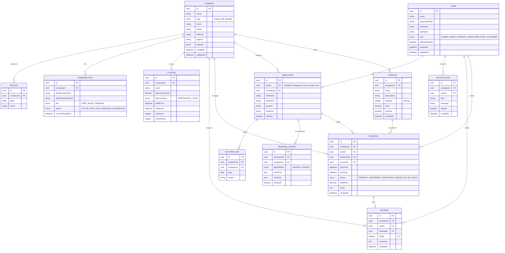

# Database Entity Relationship Diagram

This document outlines the core relational structure of the BookingHub platform.

## Table Descriptions

*   **COMPANY**: The core tenant record. All other entities (except User) are tied to a Company.
*   **USER**: Global users table. A user can be a customer of multiple companies, or an admin/employee of a specific company.
*   **SERVICE**: Services offered by a company (e.g., "Men's Haircut", "Beard Trim").
*   **EMPLOYEE**: Staff members who perform the services. They may or may not have a corresponding `USER` account for login.
*   **WORKING_HOURS**: Defines the regular weekly schedule for an employee.
*   **VACATION_DAY**: Specific dates an employee is not available, overriding regular working hours.
*   **HOLIDAY**: Company-wide closures.
*   **BOOKING**: The central transaction record linking a User, Employee, Service, and Company at a specific time.
*   **REVIEW**: Feedback left by a User after a completed Booking.
*   **COUPON**: Promotional codes created by a Company to offer discounts on Bookings.
*   **SUBSCRIPTION**: Tracks the SaaS billing state for a Company via Stripe integration.
*   **NOTIFICATION**: In-app alerts and records of sent communications to Users.
